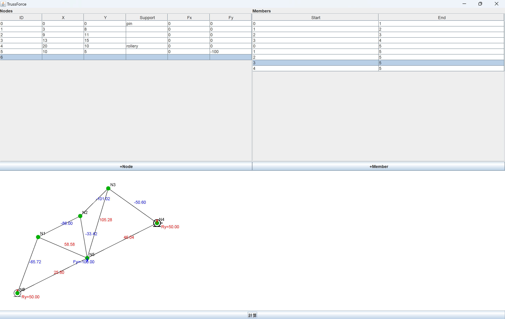
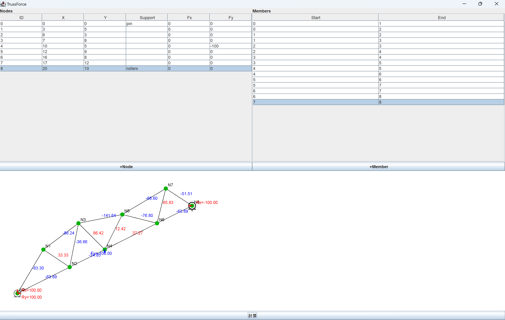

# Truss Force Calc

An application that automatically computes and visualizes internal forces in truss structures.

---

A Java-based app that calculates forces in 2D truss structures and visualizes them with color-coded diagrams. Built with Swing, powered by math.

**Note**: The UI and code comments are written in **Japanese**.  

⚠️ **This project is currently incomplete.**

It is in the testing phase, so usage and structure may change as development continues.
The folder structure is currently messy and may be reorganized in the future.

Please use with caution.

  
   
  

# TrussForce
**TrussForce** is a Java-based application that allows users to automatically compute the internal forces of 2D truss structures. It provides an intuitive UI for inputting node coordinates, member connections, and support conditions (pin, roller with x/y constraints), and visualizes the calculated truss diagram.

## 🧠 Features

- GUI-based input for:
  - Node coordinates
  - Member definitions
  - Support conditions (pin/roller supports with x/y constraints)
  - **Loads applied at each node (X and Y directions)**  
    *Note: For Y-direction loads, please enter downward loads as negative values.*
- Automatic calculation of:
  - Reaction forces
  - Internal member forces
- Truss diagram visualization with color-coded members:
  - 🔵 **Blue** for compression (negative)
  - 🔴 **Red** for tension (positive)

## ⚙️ Tech Stack

- Language: **Java**
- GUI: **Swing**
- Math: Custom-built solver using equilibrium equations and Gaussian elimination

## ▶️ How to Run

Make sure you have Java installed. Then run:

java -jar TrussForceApp.jar

---
## 🌐 Language

- This application is primarily written in **Japanese**, including:
  - Source code comments
  - Graphical User Interface (GUI)

> Note: Japanese language proficiency is recommended to use or modify this software.

## Feedback / Questions 💬  
Have any suggestions, questions, or found a bug?  
[Click here to open an issue](https://github.com/Airi20/Truss-Force-Calc/issues/new?title=Feedback&body=Feel+free+to+write+your+thoughts+below%21+%F0%9F%91%87) — I’d love to hear from you!

 * TrussForce © 2025 Airi
 * All rights reserved.
 * Unauthorized use, copying, modification, or distribution of this code is strictly prohibited.
 */
